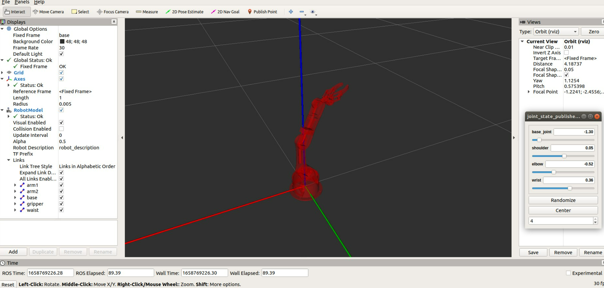

## AI task🗣:<br />

## SetUp Arduino Robot Arm 📄:

**After installing ROS in Ubuntu you need these steps to install arm package:<br />**

○ First thing we login to Ubuntu then open terminal and write those commands :<br />

```
//1. Create a workspase with Catkin:

sudo apt-get install ros-melodic-catkin 

mkdir -p ~/catkin_ws/src

cd ~/catkin_ws/ <br /> //go to the workspace

//2-Install the package of workspase using:

**catkin_make  //to compile the package

cd ~/catkin_ws/src

git clone https://github.com/smart-methods/arduino_robot_arm.git 

cd ~/catkin_ws  //go back to workspace

//3-run this instruction inside your workspace based in your ubuntu copy to install all the dependencies:

rosdep install --from-paths src --ignore-src -r -y 

sudo apt-get install ros-kinetic-moveit 

sudo apt-get install ros-kinetic-joint-state-publisher ros-kinetic-joint-state-publisher-gui 

sudo apt-get install ros-kinetic-gazebo-ros-control joint-state-publisher

sudo apt-get install ros-kinetic-ros-controllers ros-kinetic-ros-control 
```

**○ Now update your bashrc script with the information about the new workspace:** <br />

```
sudo nano ~/.bashrc

//at the end of the bashrc file add the follwing line
source /home/wesam/catkin_ws/devel/setup.bash

//then ctrl + o

source ~/.bashrc

//The final command to finally launch the Arm
roslaunch robot_arm_pkg check_motors.launch
```

## ○ Robot Arm View🔎: 



